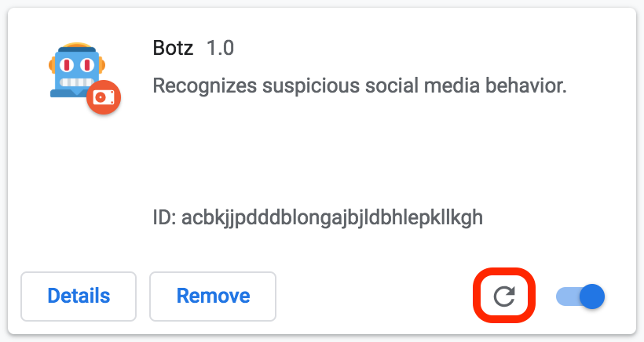
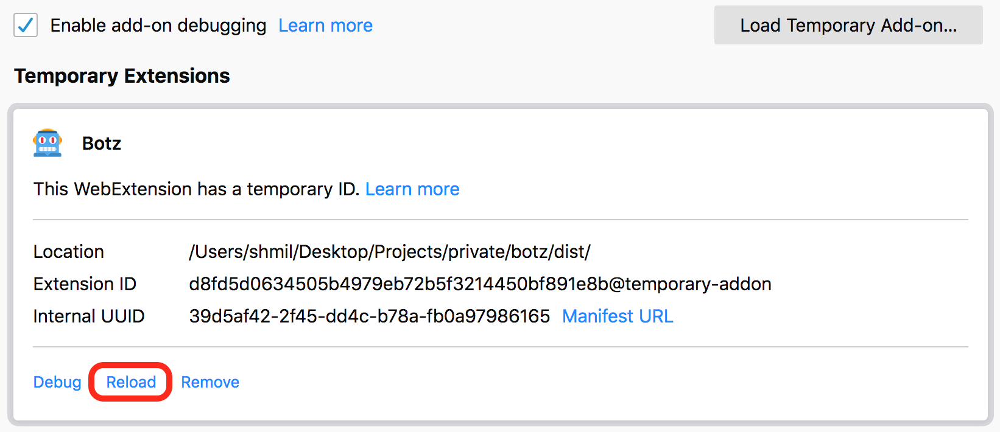

# Botz

Botz is a Chrome/Firefox extension that detects suspicious bot activity.  
The Big Bots Project is a social experiment aimed at identifying bots and sock puppets in the social platforms feeds.

Hat tip to [noam-r](https://github.com/noam-r) & [Yuval Adam](https://github.com/yuvadm) for leading the entire project.  
Thanks to anyone who participated in botim.online Hackathons!

Visit <https://botim.online> to support the project and to submit bot reports.

## Table of Contents

- [Development](#development)
- [Using the extension](#using-the-extension)
  - [Chrome](#chrome)
  - [Firefox](#firefox)
- [Contributing](#contributing)
  - [Prerequisites](#prerequisites)
  - [Submitting Changes](#submitting-changes)
- [Contributors](#contributors)

## Development

1. Clone to your computer.
1. Install dependencies:

   ```bash
   yarn install
   ```

1. Building the extension:

   ```bash
   yarn build

   # or if you want to watch for file changes
   yarn watch
   ```

1. Creating a zip file:

   ```bash
   yarn zip
   ```

## Using the extension

### Chrome

1. Access `chrome://extensions`.
1. Enable `Developer mode`.
1. Load the extension with `Load unpacked`.
1. You **must** reload the extension after each change in the code.
   

### Firefox

1. Access `about:debugging`.
2. Select `Enable add-on debugging`.
3. Load the extension with `Load Temporary Add-on...`
4. You **must** reload the extension after each change in the code.
   

- The extension is running automatically when Twitter is accessed in the browser.

## Contributing

- Having a problem with the extension? Please open an [Issue](https://github.com/botimonline/botz/issues/new).
- Willing to take your chances with some issue, please post a comment to prevent collision with someone else.

If you would like to contribute some feature/bugfix to the project, complete the following steps:

### Prerequisites

1. Bake something and eat it. :bread:
1. Install [Node.js](https://nodejs.org/en/download/).
1. Install [Yarn](https://yarnpkg.com/lang/en/docs/install/).
1. If you're using VSCode, please install the extensions: [TSLint](https://marketplace.visualstudio.com/items?itemName=ms-vscode.vscode-typescript-tslint-plugin) and [Prettier - Code formatter](https://marketplace.visualstudio.com/items?itemName=esbenp.prettier-vscode).

### Submitting Changes

1. Create a [fork](https://github.com/botimonline/botz/fork) of this repository.
2. Create a branch (`git checkout -b feat/check_bot`).
3. Commit your changes (`git commit -am "test: add some tests"`).
4. Push to the branch (`git push origin feat/check_bot`)
5. Open a [Pull Request](https://github.com/botimonline/botz/compare).

## Contributors

Thanks goes to these wonderful people ([emoji key](https://allcontributors.org/docs/en/emoji-key)):

<!-- ALL-CONTRIBUTORS-LIST:START - Do not remove or modify this section -->
<!-- prettier-ignore -->
<table><tr><td align="center"><a href="https://b48.club"><br /><sub><b>Noam R</b></sub></a><br /><a href="#business-noam-r" title="Business development">💼</a> <a href="#content-noam-r" title="Content">🖋</a> <a href="#eventOrganizing-noam-r" title="Event Organizing">📋</a> <a href="#ideas-noam-r" title="Ideas, Planning, & Feedback">🤔</a> <a href="#security-noam-r" title="Security">🛡️</a> <a href="#talk-noam-r" title="Talks">📢</a></td><td align="center"><a href="https://yuv.al"><br /><sub><b>Yuval Adam</b></sub></a><br /><a href="#business-yuvadm" title="Business development">💼</a> <a href="#content-yuvadm" title="Content">🖋</a> <a href="#eventOrganizing-yuvadm" title="Event Organizing">📋</a> <a href="#ideas-yuvadm" title="Ideas, Planning, & Feedback">🤔</a> <a href="#security-yuvadm" title="Security">🛡️</a> <a href="#talk-yuvadm" title="Talks">📢</a></td><td align="center"><a href="https://twitter.com/eranshmil"><br /><sub><b>Eran Shmil</b></sub></a><br /><a href="#ideas-eranshmil" title="Ideas, Planning, & Feedback">🤔</a> <a href="#infra-eranshmil" title="Infrastructure (Hosting, Build-Tools, etc)">🚇</a> <a href="https://github.com/botim.online/botz/commits?author=eranshmil" title="Code">💻</a></td><td align="center"><a href="https://twitter.com/ylarom"><br /><sub><b>Yuval Larom</b></sub></a><br /><a href="#ideas-ylarom" title="Ideas, Planning, & Feedback">🤔</a> <a href="https://github.com/botim.online/botz/commits?author=ylarom" title="Code">💻</a></td><td align="center"><a href="http://t35t37.wordpress.com/"><br /><sub><b>Akiva</b></sub></a><br /><a href="#ideas-abloch" title="Ideas, Planning, & Feedback">🤔</a> <a href="#infra-abloch" title="Infrastructure (Hosting, Build-Tools, etc)">🚇</a> <a href="https://github.com/botim.online/botz/commits?author=abloch" title="Code">💻</a></td><td align="center"><a href="https://github.com/ceranco"><br /><sub><b>Eran Cohen</b></sub></a><br /><a href="https://github.com/botim.online/botz/commits?author=ceranco" title="Code">💻</a></td><td align="center"><a href="https://github.com/TomKizaru"><br /><sub><b>TomKizaru</b></sub></a><br /><a href="https://github.com/botim.online/botz/commits?author=TomKizaru" title="Code">💻</a></td></tr></table>

<!-- ALL-CONTRIBUTORS-LIST:END -->

This project follows the [all-contributors](https://github.com/all-contributors/all-contributors) specification. Contributions of any kind welcome!
